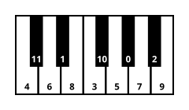
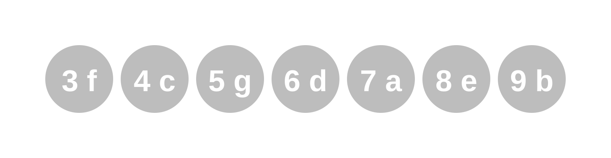
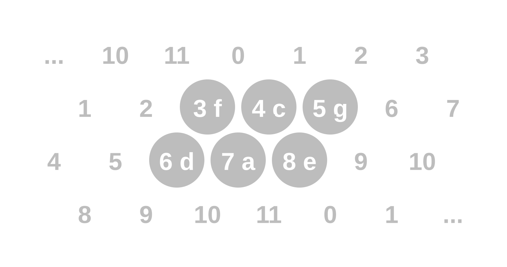
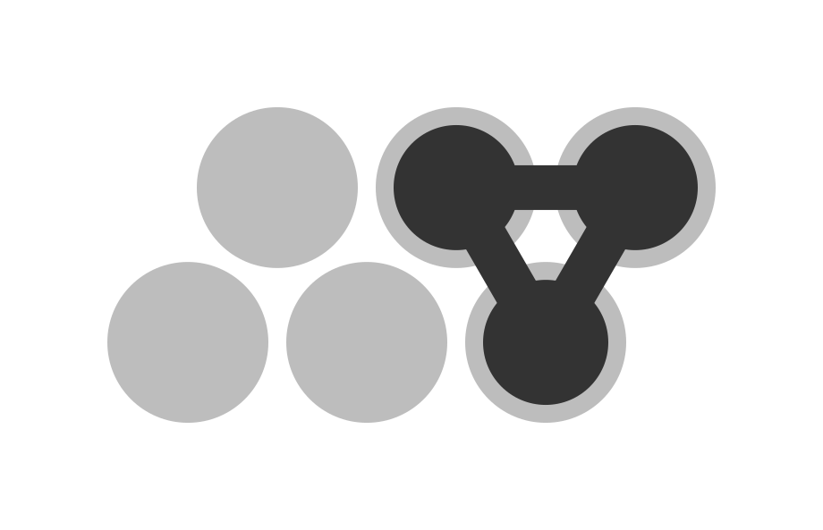
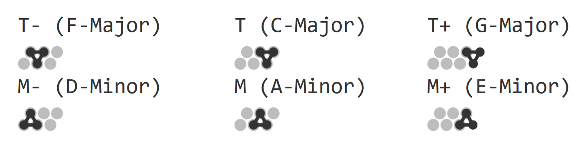
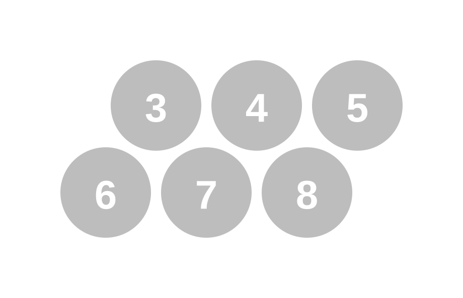
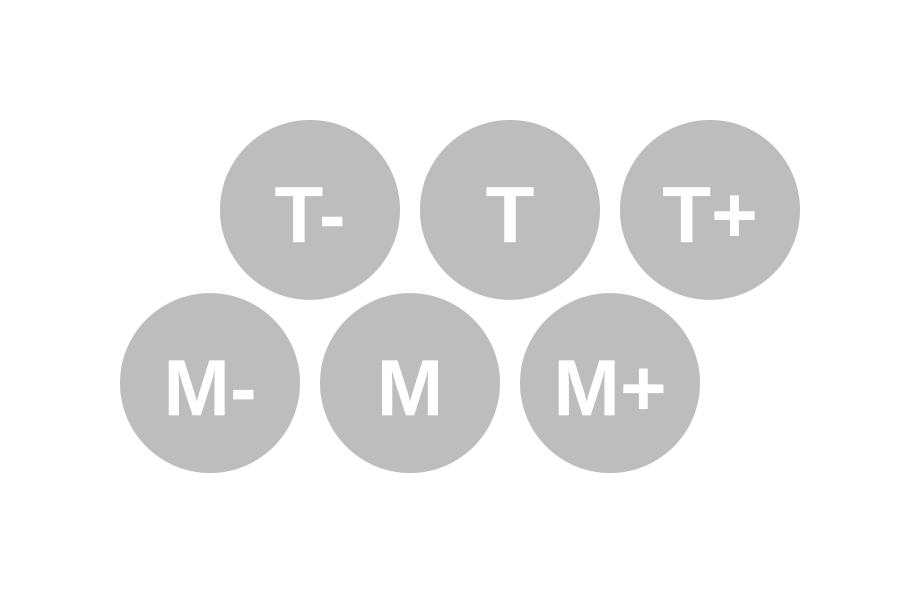
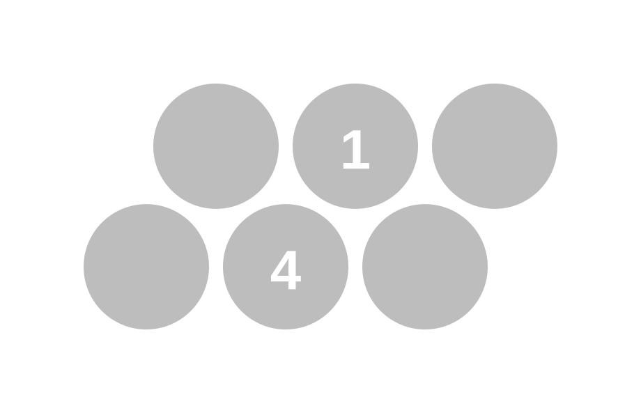

# The Harmonic System

The Harmonic System is a new way to think about music theory. By replacing traditional note names with numbers that reflect harmonic relationships, it makes analyzing, transcribing, and understanding harmony significantly easier. It can be seen as a more intuitive and consistent alternative to Roman-Numeral Analysis.

Although you don't need much music theory knowledge to use the Harmonic System, this article is written for readers who already have a basic understanding of music theory.

### How does it work?

The core idea is simple: instead of naming notes with letters (C, C#, D, …) or syllables (do, re, mi, …), we assign each note a number from $0$ to $11$. We call these **harmonic labels**. The labeling follows one rule: two notes that are a perfect fifth (7 semitones) apart always have labels that differ by 1. For example, C and G are a fifth apart, so their labels are $4$ and $5$.

*Piano octave with harmonic labels*

A useful consequence of this rule is that going up by a whole step ($2$ semitones) corresponds to adding $2$ to the label — for instance, C is $4$ and D is $6$. This makes the labels easy to remember and work with. 

To use the system effectively, you need to memorize the harmonic labels. But it will pay off, because they reveal the underlying structure of music. Now let’s see how this system simplifies traditional music theory concepts.

### Circle of fifths

The concept of ordering the notes in steps of fifths is not new at all. In fact, the circle of fifths is a well-known concept in music theory. The way we label the notes in the Harmonic System turns the circle of fifths into a simple circle of numbers like a clock.

*With harmonic labels, the circle of fifths becomes a simple clock of numbers*

This means by memorizing the harmonic labels, you have also memorized the circle of fifths!

### The major scale

When learning about music theory, it was very unclear to me why the major scale has the specific pattern of whole and half steps that it does (W W H W W W H). Why not a different pattern?

It turns out that this gets much clearer in the Harmonic System.
As an example, consider the C-major scale: C, D, E, F, G, A and B. Their harmonic labels are $4$, $6$, $8$, $3$, $5$, $7$, $9$ respectively.
These are actually just $7$ **consecutive numbers** from $3$ to $9$! The pattern of whole and half steps is just a side effect of picking seven consecutive harmonic labels. 

Similarly, any other major scale also consists of $7$ consecutive harmonic labels (consecutive on the clock). The root note of the scale is the second-lowest number in this sequence.

This observation maybe clarifies a bit, why labelling the notes in steps of fifths is so useful. The major scale was not explicitly designed to have this nice property - its just notes that sound good together.
But since the fifth is the most consonant interval (apart from the octave), it turns out that notes with close harmonic labels tend to sound consonant together. So it makes sense that the major scale, which consists of seven notes that sound most consonant together, are also the ones that have consecutive harmonic labels.
Similarly, the pentatonic scale consists of $5$ consecutive numbers, being even more consonant.

This means, that by memorizing the harmonic labels of the notes, you have also memorized the structure of the major scale in any key. The same applies to the minor scale, since it consists of the same notes as the parallel major scale. In general, it applies to all _diatonic modes_.

### Diatonic chords
Note that the order of the notes of a key on the keyboard is not the same as the order of their harmonic labels. This actually turns out to be an advantage, because the order of the harmonic labels reveals the structure of the diatonic chords in a major key: They directly show the chord types.

*The diatonic chords of a major key are the chords only consisting of notes from the major scale. They "naturally" belong to the key, and are the most commonly used chords in that key.*

Staying with C-major and its labels $3$ (F), $4$ (C ), $5$ (G), $6$ (D), $7$ (A), $8$ (E) and $9$ (B): 
- The diatonic chords of the first three notes ($3$, $4$ and $5$) are **major** chords.
- The diatonic chords of the next three are **minor** ($6$, $7$, $8$)
- The last note forms a **diminished** chord ($9$)

**Naming the diatonic chords**

The main major chord of the key, the "tonic" chord or $I$-chord, has the root note with harmonic label $4$, which in the middle between the other major chords ($3$ and $5$). We will call this chord the $T$ chord (for tonic). The other two major chords are named relative to it:
*   **T**: The tonic chord ($I$). In C-major, this is C ($4$).
*   **T-**: The subdominant chord ($IV$). In C-major: F ($3$).
*   **T+**: The dominant chord ($V$). In C-major: G ($5$).

Similarly, the main minor chord, the "parallel minor", or $vi$-chord, has the root note with harmonic label $7$(A), which is in the middle between the other minor chords ($6$ and $8$). We will call this chord the $M$ chord (for parallel *minor* or sub*mediant*). The other two minor chords are named relative to it:
*   **M**: The relative minor chord ($vi$). In C-major: Am ($7$).
*   **M-**: The supertonic chord ($ii$). In C-major: Dm ($6$).
*   **M+**: The mediant chord ($iii$). In C-major: Em ($8$).

This naming is intended to be used for both major and minor keys. In a minor key, the main minor chord (the tonic) is still called the $M$ chord, and $T$ refers to its parallel major chord. Effectively major and (natural) minor keys are not distinguished.

### Chord progressions
The new note labels also make it easier to understand chord progressions in many cases. An example is the $ii - V - I$ progression, which is considered the most fundamental chord progression in Jazz music. It might seem a bit arbitrary at first, but it turns out to be a sequence of chords descending in fifths and ending on the tonic chord. This means that in the new system the progression are just three consecutive (descending) numbers. For example, in the key of C major, it is given by $6, 5, 4$.

This is closely related to the concept of a **secondary dominant**. A secondary dominant is a chord that is a fifth above the root of another chord. Usually classic or jazz pianists will memorize, for every chord, which secondary dominant belongs to it. In the harmonic system finding a secondary dominant means adding $1$. 

### Visualizing chords

The harmonic system can easily be integrated into traditional chord notation, by just replacing the note names with their harmonic labels, for example:

$$A\flat_{\text{maj7}} \quad E\flat \quad B\flat \quad G_7 \quad C_{\text{m}} \quad \rightarrow \quad 0_{\text{maj7}} \quad 1 \quad 2 \quad 4_7 \quad 3_m$$

This way, the system can already be used effectively. However, this notation is not optimal. For example in $4_7$, numbers are used both to indicate the root note and the type of the chord, which can be a bit confusing.

Therefore, as a supplement to the harmonic system, there is a nice way to visualize chords and chord progressions in a scale. Let's start by considering the notes that make up a major scale displayed in one row. Here we take C-major again as an example.

To make it a bit more compact, we remove the last note, and then move 6, 7 and 8 to the next row. This way they are displayed in a grid-like structure, which can be seen as part of an infinite grid of notes, extending in both directions. This grid was already invented 300 years ago by the mathematician Leonhard Euler, and is known as the "Tonnetz".

*The C-major scale displayed in a grid structure, which can be seen as part of an infinite grid of notes, known as the "Tonnetz"*

In this grid, a horizontal connection is a **fifth**, a diagonal connection going down-right is a **major third**, and a diagonal connection going up-right is a **minor third**. 

Now we can visualize chords by connecting the notes that belong to the chord. For example, the tonic chord $T$ (C major) consists of the notes $4$(C ), $8$(E) and $5$(G), which form a triangle. For clarity, we will omit the note labels.

By of the symmetry of the grid, every other major chord also forms downward triangle. Minor chords are represented by upward triangles. We will call these forms the **shape** of the chord. Here are the diatonic chords at their positions in the grid:

A nice property of this representation is, that for most chords their left-to-right order on the grid matches the order on the keyboard. The leftmost point is the base note. The fastest way to recognize a chord is usually by its shape (which determines the type of the chord) and base note.

Here are some shapes of other common chords — if you play piano, see if you can identify them:

*Shapes of some common chord types*

These shapes can either be used instead of traditional chord names like "maj7" or "m7b5" to write chord progressions explicitly in a given key, for example:

Or they can be displayed relative to the key, revealing the structure of the progression, for example:

### Transposing a chord progression

Since we do not explicitly write the note labels on the gray dots which form the key, this diagram can represent the same chord progression in any key. In the chord progression above we took C-Major as an example. You can verify, that the root notes of the chords, match the corresponding notes in c major.

*The C-major scale in a grid structure*

But the notes follow the general structure, independent of the key: 

*A general scale in the grid structure* 

That means, we can read the progression any another key, by following three simple steps. Let's read the same progressoin in $1(E\flat)$-major, as an example. 

**1. Calculate $T$ and $M$**

$T = 1$ is the tonic in $1$-major. $M = 4$ is always over $T + 3$

**2. Identify roots** 

Identify where the roots (lefmost notes of the shape) are in comparison to the gray notes of the scale. Here they are in the lower left, upper right, top-middle

**3. Calculate harmonic labels** 

The labels of the notes other than $T$ and $M$ can be easily obtained by adding or substracting $1$. This gives the following progression

This makes transposing chords progressions to any key easy. 

### Details 
- During the development of the system, I initially took the note $A = 0$ as the starting point. But after realizing that the "jump" in the clock from $11$ to $0$ is a bit inconvenient, I switched to $A = 7$, $C = 4$, leading to a slightly rotated clock. This way, the scales most commonly used in pop music do not contain the jump. I believe this is the optimal choice. 
- The system is great for notation and analysis of harmony, it is not useful for melody. 

### Conclusion

The Harmonic System offers a fresh perspective on music theory, simplifying complex concepts like the circle of fifths, scale construction, and diatonic harmony. By internalizing the numeric labels, musicians can more easily see and understand the underlying structure of music. The visual language of chord shapes on the Tonnetz provides a powerful tool for music analysis. I hope this system empowers you to explore harmony in a new and intuitive way. If you want to convert chord sheets to the harmonic system, use [https://jon-of-us.github.io/chord-converter/](https://jon-of-us.github.io/chord-converter/)

### Behind the system 

When learning about music theory in school, I found it sad that something as beautiful and intuitive as music is so difficult to approach theoretically. It was a lot about memorization and concepts that felt arbitrary. I never got to the point where they paid off. 

So I started to experiment with different ways to simplify theory and notation. When I realized that many harmonic relationships are based on the fifth, I was surprised to discover such a nice and intuitive system. It was amazing to see how many concepts that I didn't understand before fell into place with the Harmonic System.

I have been learning the piano for the last 3 years using this system, and can confidently say that it makes understanding music much easier. Even if you don't actively study the theory, just seeing the harmonic labels on the sheet music makes you discover patterns that are not visible with traditional note names. I hope you like the Harmonic System as much as I do! If you have any feedback or suggestions, feel free to reach out.

Jonas

---

Jonas Ullmann, ullmann4@uni-potsdam.de
